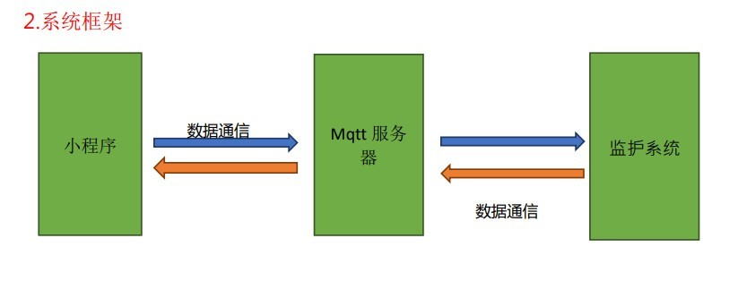
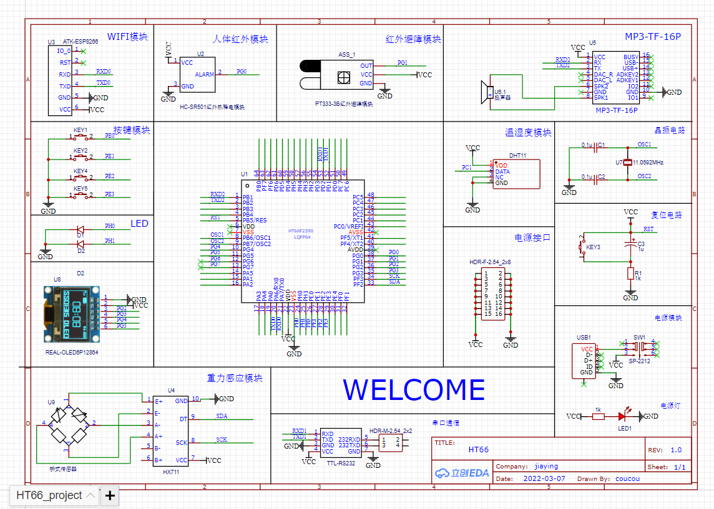
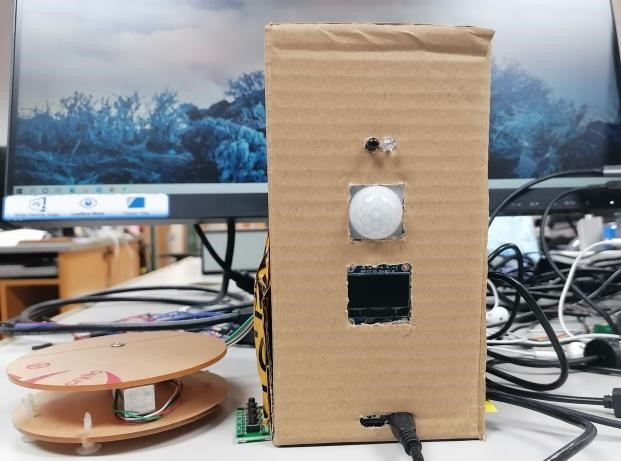
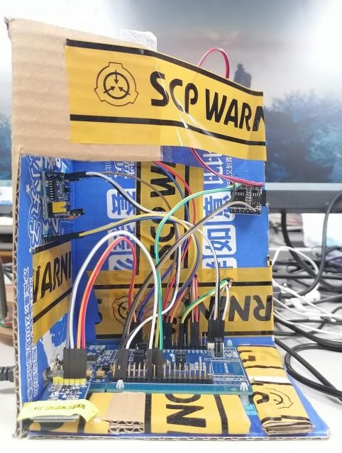
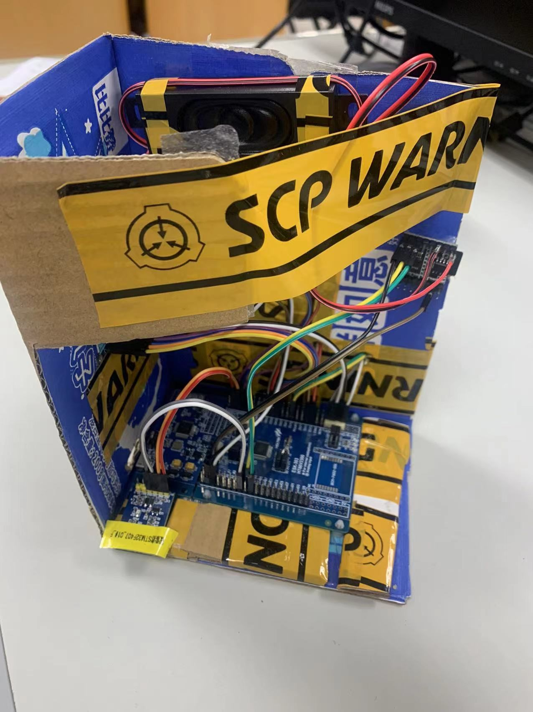
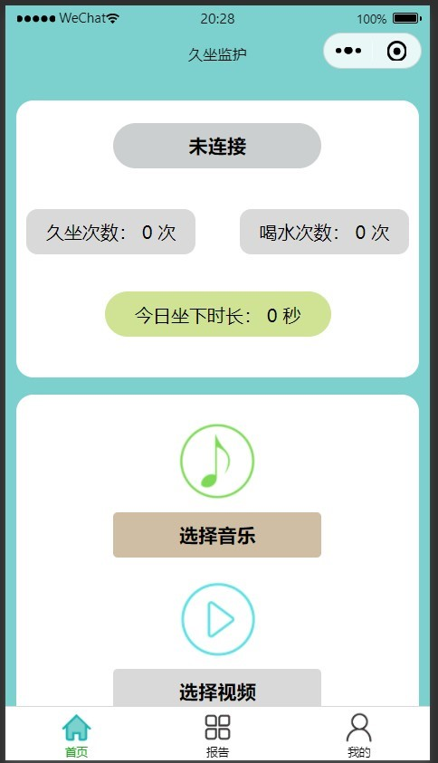
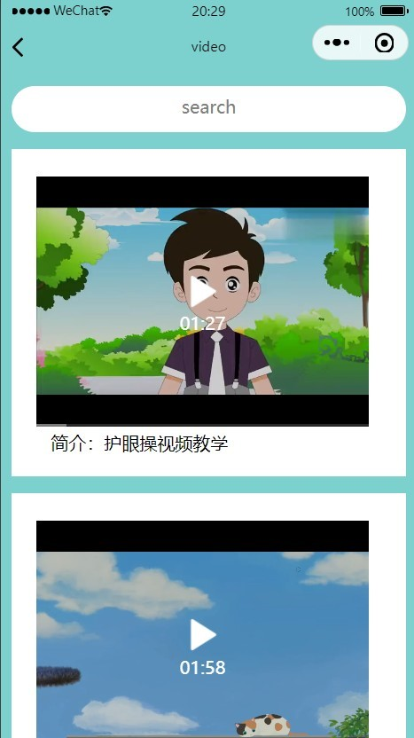
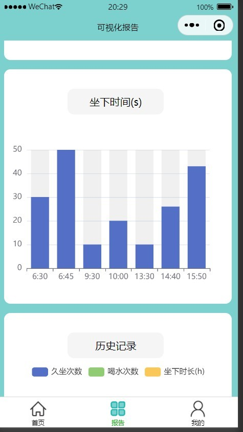
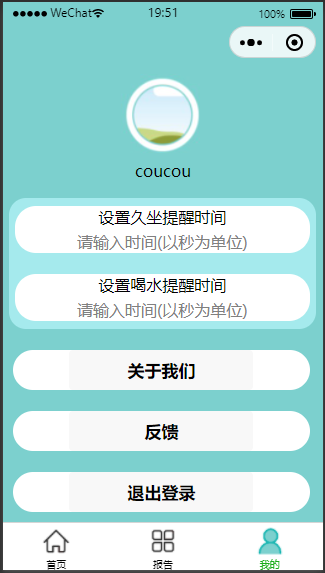

# 基于HT66的健康生活小助手

>演示地址：https://www.bilibili.com/video/BV1314y1j7Gc/

## 概述

>本项目专为办公桌前低头忙碌而忘却关心自己身体的用户而设定的提醒久坐系统，相较于市面上的手环类、坐垫类提醒久坐，我们的久坐系统最大的优点是帮助用户主动的去放松自己，并做了数据可视化，最重要的是我们预期其产品是可diy的（视觉盛宴），可作为不错的礼物送人的。
>
>本设计是基于云数据开发的防久坐监护系统，对用户的坐下学习工作之时进行监控，统计其久坐时间，喝水情况，提醒用户久坐与喝水，之后更是有音频播放和视频教学如护眼操、护颈操等，可以让用户选择适合自己喜好和身体状况的视频工间操，帮助用户主动去放松身体，从而减少久坐带来的危害，提高用户在之后的学习工作中的效率，可以作为用户工作学习时的健康小助手。

## 功能描述

>首先，项目预期最终的成品是一件漂亮的摆件（可定制），从外观上可赢得用户的喜爱。
>
>其次，针对上述久坐现象，本项目为用户久坐之时带来提醒，并在微信中基于微信小程序做出久坐提醒，当用户开始学习工作之时，小程序实时监控用户坐下时长，统计每天用户久坐次数等，并通过数据可视化呈现出来。
>
>最后，当用户久坐之后，提示是否需要播放护眼操伴奏，护颈操伴奏等，可以有效避免长时间工作或者注视屏幕带来的危害。

### 硬件功能描述

>1. 检测久坐功能    已完成
>2. 喝水提醒功能    已完成
>3. 语音提示功能    已完成
>4. 播放音乐功能    已完成
>5. 屏幕交互功能    已完成

### 微信小程序功能描述

>1. 数据可视化功能   已完成
>2. 硬件基本参数设置功能     已完成
>3. 消息通知    未完成
>4. 播放健康操等视频     已完成
>5. 播放舒缓音频      已完成

## 系统设计

### **硬件设计**

>主要通过模块化设计，如上电路图，其中主要分成检测模块、定时模块、数据传输模块和音频播放模块；
>
>​     检测模块主要有红外避障传感器和人体红外传感器，首先，在人体红外传感器的基础上，如果检测到人体红外（1米之内）， 则开启定时器，开始计时。当未检测到人时，红外避障传感器检测前方是否有障碍物阻挡，如果有则提示用户移开障碍物。(通过查阅资料，人体红外传感器和红外避障传感器满足日常判断用户是否坐下的需求)。
>
>​    定时模块只要是用来定时的，用户自主设计久坐提醒时间以及喝水时间，当检测到有人开始工作时，开始计数。
>
>​    数据传输模块主要是通过esp8266连接热点，之后连接MQTT服务器来与小程序进行通信，esp8266的使用主要是用AT指令发送命令。
>
>​    音频播放模块包括MP3解码器以及扬声器，MP3解析模块可以通过串口来发送相应的命令实现它的音频播放等功能。

### **软件设计**

   >小程序界面设计，我们在网页绘图工具里设计了小程序界面之后，寻找素材，再去编码实现。
   >
   >数据可视化图表，我们使用了echarts开源图表，之后我们在进行二次开发实现我们的动态数据可视化。
   >
   >音频和视频部分，我们从网上寻找API入口（不做商用），之后添加进小程序。
   >
   >用户自定义久坐时间以及喝水时间，通过MQTT服务器与硬件进行通信，小程序写好逻辑代码即可。

## 项目图片

### 硬件电路图

### 硬件实物图

### 微信小程序实物图

## 合泰单片机学习心得

>提高遇到问题逐步解决问题的能力，如数据的传输，我们用的是mqtt服务器作为中介做为数据传输方式，这就要有一个通信协议即mqtt协议，一个从0到有数据的传输，期间我们摸索了很久，这期间我们需要搭建mqtt服务器，了解mqtt的通信协议并连接上mqtt，硬件和小程序都要连接，订阅mqtt主题，最终实现数据通信。
>
>还有就是项目整合，其实这部分是最痛苦的，要不断的调bugg，代码逻辑整合，测试，调整测试……不知道多少次之后才勉强运行起来（可能还有很多未知的bugg）。
>
>关于这次比赛，我觉得我的综合能力有了较大的提高，无论是对项目的计划与实现，还是考虑问题的多方面性，希望以后能不断进步，学业有成。
>
>
